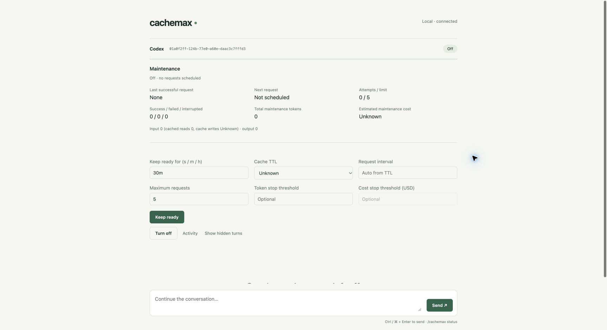
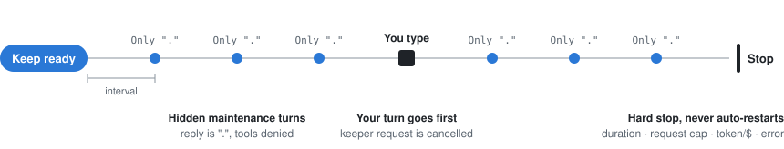

# cachemax

[English](README.md) | **한국어**

[](LICENSE)


자리를 비운 동안 Claude Code, Codex, Grok Build 대화를 준비된 상태로 유지합니다.
cachemax는 **같은 세션**에 숨겨진 짧은 `Only .` 턴을 주기적으로 보내고, 정한 한도에서
확실히 멈추며, 요청마다 실제로 쓴 사용량을 보여 줍니다.



> [!WARNING]
> 유지 요청은 로그인된 계정으로 실행되므로 **전체 비용이 늘어날 수 있습니다.**
> `.` 한 글자로 답해도 대화 전체를 읽습니다. 비용 절감과 제공자 캐시 유지는 보장되지 않으며,
> 선택한 TTL은 로컬 스케줄에만 쓰입니다.

## 동작 방식



- **같은 대화, 숨겨진 턴.** 관리 페이지에서는 유지 턴이 보이지 않고, 호스트 원본 기록에는 모두 남습니다.
- **사용자가 먼저.** 진행 중인 유지 요청을 취소한 뒤 사용자 메시지를 보냅니다.
- **자리를 비웠을 때만.** 대기 시간은 마지막 답변부터 셉니다. **Keep ready** 전이나 네이티브 CLI에서 받은 답변도 포함합니다. TTL 1h(간격 50분)에서 25분에 메시지를 보내면 다음 유지 요청은 그 답변 50분 뒤로 밀립니다. 이미 간격이 지났다면 첫 요청을 바로 보냅니다.
- **기본값부터 제한.** 따로 바꾸지 않으면 30분, 10회까지만 보냅니다. 오류나 예상 밖 응답이 나오면 멈추고, 스스로 다시 켜지지 않습니다.
- **추가 설정 없음.** API 키, npm 의존성, 빌드 단계가 필요 없습니다. 기존 CLI 로그인을 그대로 씁니다.

## 캐시가 유지되나요?

구독 계정으로 실제 실행한 결과입니다. 따로 적지 않은 결과는 0.1.1에서 측정했습니다
([검증](docs/validation-report.md) · [분석](docs/cache-analysis.md) · [후속 검증](docs/reproducibility-report.md)).

| 호스트 | 자리를 비운 동안 캐시 유지 |
| --- | --- |
| Codex | **유지됨.** 35–70분 뒤 보낸 다음 메시지가 약 99.5%를 캐시에서 읽었습니다(cachemax 없이 약 84%). 차이의 일부는 새로 추가된 지시문을 미리 처리한 효과입니다. |
| Claude Code | **엇갈림.** 0.1.1에서는 매 턴 대화 캐시 대부분을 새로 썼습니다. 이후 3분 간격의 짧은 실행에서는 캐시에서 읽었습니다. 대조군과 다시 비교하지는 않았습니다. |
| Grok Build | **불안정.** 3분 간격에서도 유지 요청이 캐시를 자주 놓쳤습니다. |

Codex와 Grok은 짧은 휴식에는 필요 없습니다. 12분 정도 쉬었을 때는 cachemax 없이도
99.5% 이상을 캐시에서 읽었습니다.

**결론:** 정한 한도 안에서 세션을 안정적으로 유지합니다. 다만 비용을 줄인다는 근거는
없습니다. 측정한 Claude·Grok 쌍은 모두 cachemax를 쓴 쪽의 비용이 더 컸습니다.

## 빠른 시작

Node.js 22.18 이상, macOS(Linux·Windows는 미검증), 로그인된 호스트 CLI가 필요합니다.

```sh
# 1. 플러그인 (사용하는 호스트 하나)
claude plugin marketplace add helloimdevman/cachemax && claude plugin install cachemax@cachemax
codex plugin marketplace add helloimdevman/cachemax && codex plugin add cachemax@cachemax
grok plugin install helloimdevman/cachemax#plugins/cachemax

# 2. CLI 설치 후 관리 세션 시작
git clone https://github.com/helloimdevman/cachemax.git && cd cachemax
npm install --global .
cachemax doctor
cachemax run claude          # 또는 codex, grok
```

출력된 비공개 localhost URL을 열고 TTL과 한도를 고른 뒤 **Keep ready**를 누르세요.
유지 기능은 항상 **꺼진 상태**로 시작합니다. 호스트 안에서는 `cachemax` 스킬이 관리 세션을
제어하거나, 현재 세션을 넘길 handoff 명령을 알려 줍니다.

**기존 세션:** 진행 중인 턴을 끝내고 네이티브 클라이언트를 닫은 뒤
`cachemax run codex --session ID --cwd /원래/디렉터리 --handoff`를 실행하세요.

## 설정

| 설정 | 기본값 | 규칙 |
| --- | --- | --- |
| 지속 시간 | 30m | 최대 24h. 종료 시각은 활성화할 때 고정됩니다. |
| 최대 요청 | 10 | 1–120 |
| 간격 | TTL 기준: Unknown·5m → 3m, 1h → 50m, Custom → TTL의 5/6 | TTL보다 짧아야 함 |
| 토큰 / $ 한도 | 꺼짐 | 응답 후에 확인하므로 요청 한 번이 한도를 넘을 수 있습니다. $ 한도는 Claude·Grok만 지원합니다. |

절전에서 깨어난 뒤 밀린 요청을 몰아서 보내지 않습니다. 턴이 끝날 때마다 간격을 다시 셉니다.

## 명령

```text
# 관리 페이지에서
/cachemax 30m | off | status | logs | show-hidden

# 다른 터미널에서
cachemax on     --host codex --session ID --duration 30m --ttl 5m --max-ticks 10 [--max-tokens N] [--max-cost-usd N]
cachemax off    --host codex --session ID
cachemax status --host codex --session ID      # 조회만, 모델 요청 없음
cachemax logs   --host codex --session ID
cachemax forget --host codex --session ID      # 중지된 세션의 메타데이터 삭제
```

## 지원 호스트

| 호스트 | 테스트 버전 | 전송 방식 | 유지 요청 도구 차단 |
| --- | --- | --- | --- |
| Claude Code | 2.1.282 | Structured print + resume | 번들 PreToolUse deny hook |
| Codex | 0.156.1 | App Server thread/turn API | 번들 hook, 호스팅 웹 검색 끔 |
| Grok Build | 1.0.41 | Structured headless + resume | 네이티브 `--deny '*'` |

유지 요청은 세션의 모델을 그대로 쓰며, 저가 모델이나 서브에이전트를 쓰지 않습니다. 숨김은
관리 페이지에서만 적용되므로 네이티브 화면에는 유지 턴이 보일 수 있습니다. 네이티브 `/loop`는
지원하지 않으며 `--require-native-loop`는 거부됩니다. headless 턴은 대화형 승인을 거부하니,
승인이 필요한 작업은 runner를 닫고 네이티브 CLI에서 하세요.
자세한 내용은 [호환성 매트릭스](docs/compatibility-matrix.md)를 참고하세요.

## 개인정보

- `127.0.0.1`에만 바인딩되고 무작위 토큰을 요구합니다. URL은 세션 접근 권한처럼 다루세요.
- 텔레메트리가 없습니다. 인증 정보를 읽거나 복사하지 않으며, 대화 내용은 호스트가 관리합니다.
- 메타데이터는 `~/.cachemax`(또는 `CACHEMAX_HOME`)에 권한 `0600`으로 저장됩니다.
- 제거: runner를 멈추고, 호스트의 플러그인 제거 명령을 실행한 뒤 `npm uninstall --global cachemax`를 실행하세요.

## 개발

```sh
npm test                                   # 오프라인, 모델 사용 없음
npm run check
node tests/browser-reconnect.mjs           # Ego Lite + 로컬 가짜 호스트
npm run test:live -- --confirm-usage       # 호스트당 실제 모델 턴 3회
```

문서(일부 영문): [문제 해결](docs/troubleshooting.md) · [개인정보](docs/privacy.md) ·
[검증](docs/validation-report.md) · [캐시 분석](docs/cache-analysis.md) ·
[3개 호스트 후속 검증](docs/reproducibility-report.md) · [사용량 절감](docs/usage-minimization.md)

## 라이선스

[MIT](LICENSE)
