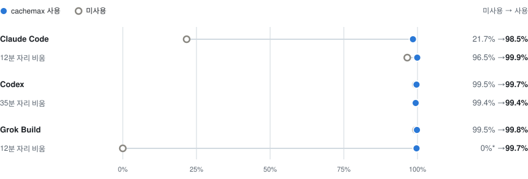

# cachemax

[English](README.md) | **한국어**

[](LICENSE)


자리를 비운 동안 **Claude Code, Codex, Grok Build 대화의 캐시**를 유지합니다.
cachemax는 같은 세션에 `Only ".". No tools.`를 주기적으로 보내고, 로컬 브라우저 페이지에서
유지 턴을 숨기며, 정한 한도에서 멈춥니다. 기존 CLI 로그인을 그대로 쓰므로
API 키, npm 의존성, 빌드 단계가 필요 없습니다.

> [!WARNING]
> **유지 요청으로 전체 사용량과 비용이 늘어날 수 있습니다.** `.` 한 글자로 답해도 대화를 읽습니다.
> 캐시 유지와 비용 절감은 보장되지 않습니다. 선택한 TTL은 로컬 요청 간격에만 적용됩니다.

## 빠른 시작

**Node.js 22.18 이상**, macOS, 로그인된 호스트 CLI가 필요합니다. Linux·Windows는 미검증입니다.

```sh
npx skills add helloimdevman/cachemax -g -a claude-code codex grok
```

1. 유지하려는 대화에서 Claude Code·Grok Build는 `/cachemax`, Codex는 `$cachemax`를 실행합니다.
2. 최대 요청 횟수(**기본 5회**)와 캐시 TTL(**기본 알 수 없음**)을 고릅니다.
3. **10분 안에 CLI를 종료합니다.** cachemax가 세션을 넘겨받아 브라우저에서 엽니다.
   대화는 그 페이지에서 이어 가세요. 사용자 메시지가 유지 요청보다 우선합니다.

CLI를 종료하기 전에 같은 스킬에 `off`를 붙여 실행하면 취소됩니다. 스킬에 런타임이 포함돼 있습니다.

<details>
<summary>관리 페이지 미리 보기</summary>


</details>

## 실측 캐시 효과와 사용량

그림의 값은 **복귀 요청의 입력 중 캐시에서 읽은 비율**이며, 캐시 적중 확률이 아닙니다.
2026-09-29 구독 계정에서 3분 간격으로 측정했고, 조건에 맞춰 지속 시간과 요청 한도를
늘렸습니다. **기본 설정은 5회 뒤 멈춥니다.**



- **Claude Code·Codex:** 미사용군도 1시간까지 대부분을 캐시에서 읽었습니다.
  2시간에 Codex는 미사용 0–15.2%, 사용 99.5%였습니다.
- **Grok Build:** 15분 이후 미사용군은 8회 중 7회에서 0–21.6%만 캐시에서 읽었고,
  사용군은 99.7–99.9%였습니다.
- **완료된 모든 쌍에서 사용량이 늘었습니다.** 왼쪽 수치는 예열 후 유지 요청 + 복귀 요청을
  합친 값입니다. Claude·Grok은 CLI 달러 추정치, Codex는 입력 토큰이며 실제 청구액·구독 한도와 다릅니다.

† Claude 2시간 조건은 두 번 모두 약 98분에 API 재시도로 멈췄고, 유지 요청 31회가 완료됐습니다.
복귀 값은 참고용으로만 표시하고 추가 사용량 범위에서 제외했습니다. 호스트·시간별 2쌍이며,
계정을 공유한 작은 표본이라 제공자 TTL을 확정할 수 없습니다.
[측정 방법·전체 결과·원자료](docs/idle-sweep-2026-09-29.md).

## 동작 규칙

- **사용자 메시지 우선.** 진행 중인 유지 요청을 취소한 뒤 사용자 메시지를 보냅니다.
- **마지막 답변부터 대기.** 활성화 전이나 네이티브 CLI에서 받은 답변도 포함합니다.
  턴이 끝날 때마다 간격을 다시 세며, 활성화할 때 이미 간격이 지났다면 첫 요청을 바로 보냅니다.
- **한도나 오류에서 정지.** 고정된 종료 시각, 요청 횟수, 선택한 토큰·비용 한도를 적용합니다.
  예상 밖 응답도 중단 사유입니다. 자동으로 다시 켜지지 않으며, 절전 뒤 밀린 요청을 몰아 보내지 않습니다.
- **관리 페이지에서 숨김.** 유지 턴은 호스트 원본 기록에 남으며 네이티브 화면에는 보일 수 있습니다.

## 한도와 기본값

| 설정 | 기본값 | 한도·동작 |
| --- | --- | --- |
| 요청 횟수 | 5회 | 1–120회 |
| 지속 시간 | 스킬: 요청 횟수에 맞춤; 페이지: 30m | 최대 24h; 종료 시각은 활성화할 때 고정 |
| 요청 간격 | TTL 알 수 없음·5m → 3m; 1h → 50m | 사용자 지정 TTL → TTL의 5/6; 간격은 TTL보다 짧아야 함 |
| 토큰·비용 한도 | 꺼짐 | 유지 요청만 집계; 응답 후 확인하므로 요청 한 번이 한도를 넘을 수 있음 |

비용 한도는 Claude·Grok만 지원하며, 한도 확인에 필요한 사용량이 없으면 중단합니다.
세션의 모델을 그대로 쓰고 유지 요청의 도구 사용을 차단합니다. 네이티브 `/loop`와
`--require-native-loop`는 미지원입니다. 대화형 승인이 필요한 작업은 runner를 닫고 네이티브 CLI에서 하세요.
측정 버전은 Claude Code **2.1.284**, Codex **0.158.0**, Grok Build **1.0.41**입니다.
도구 차단과 전송 방식은 [호환성 매트릭스](docs/compatibility-matrix.md)를 참고하세요.

<details>
<summary>플러그인 설치와 터미널 명령</summary>

```sh
# 플러그인: 사용하는 호스트 하나
claude plugin marketplace add helloimdevman/cachemax && claude plugin install cachemax@cachemax
codex plugin marketplace add helloimdevman/cachemax && codex plugin add cachemax@cachemax
grok plugin install helloimdevman/cachemax#plugins/cachemax

# 독립 CLI
git clone https://github.com/helloimdevman/cachemax.git && cd cachemax
npm install --global .
cachemax run codex          # 또는 claude, grok
```

`run`은 유지 기능이 **꺼진 상태**로 로컬 대화를 엽니다. TTL·한도를 정하고 **Keep ready**를 누르세요.
기존 세션을 넘기려면 네이티브 클라이언트를 먼저 닫은 뒤 실행합니다.

```sh
cachemax run codex --session ID --cwd /원래/디렉터리 --handoff
```

호스트에서는 스킬(`/cachemax` 또는 `$cachemax`) 뒤에 `[요청 횟수] [ttl]`, `off`, `status`,
`logs`를 붙입니다. 관리 페이지에서는 `/cachemax 30m`, `/cachemax off`, `/cachemax status`,
`/cachemax logs`, `/cachemax show-hidden`을 씁니다. 다른 터미널에서는:

```sh
cachemax on     --host codex --session ID --duration 30m --ttl 5m --max-ticks 5
cachemax off    --host codex --session ID
cachemax status --host codex --session ID      # 모델 요청 없는 조회
cachemax logs   --host codex --session ID
cachemax forget --host codex --session ID      # 중지된 세션 메타데이터 삭제
```

`on`에는 `--max-tokens N`, `--max-cost-usd N`(Claude·Grok만)도 붙일 수 있습니다.
제거하려면 먼저 유지를 끄고 `npx skills remove cachemax -g`를 실행하세요.
플러그인·CLI로 설치했다면 해당 호스트의 플러그인 제거 명령과 `npm uninstall --global cachemax`를 사용하세요.

</details>

## 개인정보

- 로컬 전용: `127.0.0.1`에만 바인딩하고 무작위 토큰을 요구합니다. URL은 세션 접근 권한처럼 다루세요.
- 텔레메트리가 없고 인증 정보를 읽거나 복사하지 않습니다. 대화 내용은 호스트가 관리합니다.
- 메타데이터: `~/.cachemax`(또는 `CACHEMAX_HOME`), 권한 `0600`. [자세한 내용](docs/privacy.md).

<details>
<summary>개발과 측정 보고서</summary>

```sh
npm test                                    # 오프라인; 모델 사용 없음
npm run check
node scripts/render-readme-charts.mjs        # 저장된 자료에서 한·영 그래프 재생성
node scripts/render-readme-charts.mjs --check
```

브라우저 검사: `node tests/browser-reconnect.mjs`(Ego Lite + 로컬 가짜 호스트).
실제 모델 검사: `npm run test:live -- --confirm-usage`(호스트당 실제 모델 턴 3회).

보고서(일부 영문): [검증](docs/validation-report.md) · [캐시 분석](docs/cache-analysis.md) ·
[3개 호스트 후속 검증](docs/reproducibility-report.md) · [후속 재측정](docs/remeasurement-2026-09-27.md) ·
[비운 시간별 측정](docs/idle-sweep-2026-09-29.md) · [사용량 절감](docs/usage-minimization.md).

</details>

[문제 해결](docs/troubleshooting.md) · [MIT 라이선스](LICENSE)
