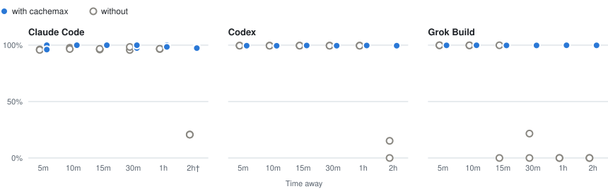

# cachemax

**English** | [한국어](README.ko.md)

[](LICENSE)


Keep your **Claude Code, Codex, or Grok Build conversation** warm while you step away.
cachemax sends short requests to the same session and hides them in a local browser page.
Uses your existing CLI login.

## Quick start

```sh
npx skills add helloimdevman/cachemax -g -a claude-code codex grok
```

1. In the conversation to keep, run `/cachemax` in Claude Code or Grok Build, or `$cachemax` in Codex.
2. Choose the maximum requests (**default 5**) and cache TTL (**default unknown**).
3. **Exit the CLI within 10 minutes.** cachemax takes over and opens the conversation in your
   browser. Continue there; your messages take priority over maintenance.

To cancel before exiting, run the same skill with `off`.

<details>
<summary>Preview the managed page</summary>


</details>

## Measured cache effect and usage



- **Codex, 2 hours:** 0–15.2% without cachemax; 99.5% with cachemax.
- **Grok Build, 15 minutes onward:** 0–21.6% in 7 of 8 turns without cachemax; 99.7–99.9% with cachemax.

## How it behaves

- Your message takes priority over maintenance.
- Each completed reply resets the request interval.
- Maintenance stops at the duration, request, token, or cost limit.
- Maintenance turns are hidden in the page and retained in the host transcript.

## Limits and defaults

| Setting | Default | Range / scheduling |
| --- | --- | --- |
| Requests | 5 | 1–120 |
| Duration | Skill: fits request count; page: 30m | Up to 24h |
| Interval | Unknown/5m TTL → 3m; 1h → 50m | Custom TTL → 5/6 of TTL |
| Maintenance token / cost limit | Off | Cost limit: Claude and Grok |

<details>
<summary>Plugin installation and terminal commands</summary>

```sh
# Plugin: choose your host
claude plugin marketplace add helloimdevman/cachemax && claude plugin install cachemax@cachemax
codex plugin marketplace add helloimdevman/cachemax && codex plugin add cachemax@cachemax
grok plugin install helloimdevman/cachemax#plugins/cachemax

# Standalone CLI
git clone https://github.com/helloimdevman/cachemax.git && cd cachemax
npm install --global .
cachemax run codex          # or: claude, grok
```

`run` opens a local conversation with maintenance **off**. Set TTL and limits, then click
**Keep ready**. For an existing session, close its native client first, then use:

```sh
cachemax run codex --session ID --cwd /original/dir --handoff
```

In the host, pass `[requests] [ttl]`, `off`, `status`, or `logs` to the skill
(`/cachemax` or `$cachemax`). In the managed page, use `/cachemax 30m`, `/cachemax off`,
`/cachemax status`, `/cachemax logs`, or `/cachemax show-hidden`. From another terminal:

```sh
cachemax on     --host codex --session ID --duration 30m --ttl 5m --max-ticks 5
cachemax off    --host codex --session ID
cachemax status --host codex --session ID      # no model request
cachemax logs   --host codex --session ID
cachemax forget --host codex --session ID      # remove stopped session metadata
```

`on` also accepts `--max-tokens N` and `--max-cost-usd N` (Claude/Grok only).
To uninstall, stop maintenance, then run `npx skills remove cachemax -g`; for plugin/CLI
installs, remove the host plugin and run `npm uninstall --global cachemax` as applicable.

</details>

[MIT license](LICENSE)
